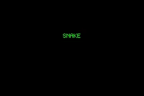

# ruby-gba

**A Ruby DSL that compiles to real Game Boy Advance ROMs — built as a teaching tool, and written end-to-end by AI.**

You write plain Ruby. `ruby-gba` turns it into an ARM7 cartridge that boots on a real GBA or any emulator. The guiding rule is simple: **you should need to know Ruby, not the hardware.** No VRAM, no DISPCNT, no ARM assembly, no "why is my screen black" — the framework manages the machine and turns the classic footguns into friendly, plain-language errors.

It is also an experiment in **AI-native tooling**: every line here was written by an AI agent, and the whole toolchain is shaped around giving an agent (and a human) fast, mechanical, readable feedback while building a game.



> The game above is a complete Snake — growing body, random food, scoring, game-over — written in the DSL. Full source: [`examples/snake.rb`](examples/snake.rb).

```ruby
require_relative "lib/ruby_gba"

# A trimmed slice of examples/snake.rb — see that file for the full, commented game.
# (Grid constants like CELL, MIN_COL, BODY_CAP and the STEP beat are defined there.)
rom = RubyGBA.build("SNAKE", code: "BSNK", maker: "01") do
  screen :bitmap
  enable_sound
  define_sound :eat, frequency: 880, duty: :quarter, decay: :fast

  # The snake's body is two parallel lists (xs[i], ys[i]), one entry per cell.
  # `list` is a bounded, runtime-sized collection — a ring buffer in IWRAM.
  xs = list :xs, capacity: BODY_CAP
  ys = list :ys, capacity: BODY_CAP

  var :state, 0
  dx = var :dx, 1
  dy = var :dy, 0
  food_x = var :food_x, 0
  food_y = var :food_y, 0
  score  = var :score, 0

  func :spawn_food do
    roll :food_x, MIN_COL..MAX_COL      # a deterministic PRNG stream (seed / roll / rand)
    roll :food_y, MIN_ROW..MAX_ROW
  end

  func :step_snake do
    hx = xs.last + dx                   # arithmetic on list cells + handles
    hy = ys.last + dy
    # Hit a wall -> game over; else grow a new head and either eat or slide forward.
    ((hx < MIN_COL) | (hx > MAX_COL) | (hy < MIN_ROW) | (hy > MAX_ROW)).then do
      state.set 2
      beep :die
    end.else do
      xs.push hx; ys.push hy
      draw_rect_at hx * CELL, hy * CELL, CELL, CELL, :white
      ((hx == food_x) & (hy == food_y)).then do    # ate the food: grow + score
        score.add 1; beep :eat; call :spawn_food
      end.else do
        xs.shift; ys.shift                          # slid forward: drop the tail
      end
    end
  end

  scene :playing do
    # Steer if the turn is perpendicular (the full file buffers it so you can't reverse).
    held(:up).then    { (dy == 0).then { dx.set 0; dy.set(-1) } }
    held(:right).then { (dx == 0).then { dx.set 1; dy.set 0 } }
    every(STEP) { call :step_snake }    # move on a beat, not every frame
  end

  game_loop do
    wait_vblank
    case_var :state do
      when_val 1, :playing              # title (0) + game_over (2) omitted — see full file
    end
  end
end

rom.write("snake.gba")   # guardrails run during build; rom.explain shows the cost tree
```

Build it and run it in any GBA emulator:

```bash
ruby examples/snake.rb     # => writes snake.gba
rake test                  # unit + (optional) emulator integration tests
```

---

## Design pillars

### Teaching tool first — hide the hardware

Every user-facing verb speaks intent and color *names*, never registers or jargon. `screen :bitmap`, `draw_rect_at`, `beep :eat`, `clear_screen :black`. The framework owns the palette, VRAM layout, VBlank timing, and DMA. Sensible, safe defaults (edge-clipping, safe writes) mean nothing corrupts memory or silently fails — and a **raw escape hatch** stays available for anyone who *wants* to drop down to the metal.

### Guardrails — footguns become teaching errors

The worst part of learning the GBA is that mistakes rarely tell you *what* went wrong. A wrong register, a draw that runs off-screen, an 8-bit store into 16-bit-only memory — and you get a silent black screen, or garbled visuals, or memory corruption that surfaces somewhere unrelated, or a ROM that works in one emulator and hangs on real hardware. The failure is almost never next to its cause. So known footguns are caught at **build time** and explained in plain language: *drew something but never set a screen mode*, *game loop that never waits for the screen*, *a draw that lands entirely off-screen*, *a comparison used as a native Ruby `if`*. Fatal problems stop the build so a broken ROM can't ship; advisories print and let it through. Fixes are **suggested, never silently applied** (opt-in `--auto-fix` is planned). The check registry is **extensible** — a feature or plugin can register its own guardrails.

### The value-centric DSL — why it matters

`var :dx, 1` returns a **handle**, and comparisons build a small expression tree rather than executing immediately:

```ruby
(hy > MAX_ROW).then { state.set 2 }          # a Condition, not a Ruby `if`
ate = (hx == food_x) & (hy == food_y)        # comparisons composed with &
xs.push xs.last + dx                         # arithmetic on handles and list cells
```

This matters because those handles and comparisons are **data the compiler can see**. `xs.last + dx` isn't run — it's recorded, so it can be validated, cost-estimated, optimized, and lowered to whatever the target needs. It also lets guardrails catch the `if`-instead-of-`.then` slip (a comparison used as a native Ruby `if` silently does nothing on hardware) and gives every operand one consistent, checkable shape.

### The IR — one description, many targets

The DSL does **not** emit ARM directly. Each verb builds a node in an in-memory **intermediate representation** (IR) — a plain-Ruby, inspectable op-tree. A separate pass validates it, then a **backend** consumes it: one *lowers* it to an ARM7 ROM, another *interprets* it in pure Ruby to a framebuffer (used for headless tests and as the reference oracle). A **cross-backend conformance fixture** keeps them honest against shared reference semantics (`IR::Int32`, signed 32-bit).

This adds a layer of machinery, and it earns it: forward references (branches, calls, scene jumps) resolve automatically in a two-pass lowering instead of hand-rolled offset math; whole-program passes like register allocation and constant-pooling become possible; guardrails inspect the whole program *before* a byte is emitted; and — the big one — **new targets are new backends, not a rewrite of the language.** Nodes are tagged **portable vs hardware-only**, which is what makes the future web/GBC targets tractable.

### Cost estimator + `rom.explain` — see the work

Because the program is inspectable, `ruby-gba` estimates how much *drawing* each frame does — in "write-units" — and exposes it as a structured tree (human-readable *and* JSON):

```ruby
rom.explain   # drill-down cost tree: which scene / func / loop draws the most per frame
```

This is both a **teaching aid** (understand why a frame is heavy) and a **debugging tool** (a guardrail can warn when a loop redraws the whole screen every frame — the exact reason Snake draws incrementally). Cost profiles will eventually be parameterized per backend (GBA vs GBC).

### Future targets

The backend split is deliberate. Planned peers of the ARM backend, all reusing the same IR:

- **JavaScript / `<canvas>`** — ship a game to the web, plus an instant in-browser live preview.
- **Terminal (TTY)** — render the framebuffer as half-block ANSI; run a game in any terminal, even over SSH.
- **Game Boy Color** — an all-new lowering (8-bit SM83, tile/OAM/palette rendering). Large, but the architecture already supports adding it cleanly.

---

## Built by AI, for AI-assisted development

This entire tool is AI-written, and the workflow is designed so an agent can iterate safely and fast:

- **Tight, mechanical feedback loops.** The Ruby interpreter renders the IR headlessly (no emulator needed), a pixel Verifier reads back actual frames, guardrails give plain-language pass/fail at build time, and `rom.explain` emits a machine-readable cost tree an agent can reason over. An agent can build → validate → run → diff → explain without leaving Ruby.
- **Mechanical safety rails.** An IR verifier enforces the value model on every build (a malformed tree is a *library* bug, raised loudly); the conformance fixture diffs backends so a change can't silently break one target.
- **Persistent, cross-session memory.** Work is tracked in [**beads**](https://github.com/gastownhall/beads) (`bd`) — a dependency-aware issue graph living in the repo — so an agent can recover context, see what's ready, and pick up mid-stream across sessions. Agent guidance lives in `CLAUDE.md` / `AGENTS.md`.

---

## Feature progress

A rough map of the GBA surface. Checked = working today; unchecked = planned (tracked in `bd`).

**Working**

- [x] Bitmap display — Mode 3, 240×160, 15-bit color
- [x] Drawing — pixels, rectangles, DMA fills, screen clear
- [x] Bitmap images + runtime `blit` (transparency, edge-clipping; ASCII-art or array)
- [x] Text + `draw_number` (built-in 5×7 font)
- [x] Value-centric expression DSL — `.then`/`.else`, `&`/`|`, integer division
- [x] Control flow — `func`/`call`, `scene`/`case_var`, `game_loop`, `repeat`
- [x] Input — D-pad + buttons (`held` / `pressed`)
- [x] Sound — two PSG channels (music + SFX): `song`, `beep`, `define_sound`
- [x] Deterministic randomness — `seed` / `roll` / `rand` / `chance` / `randomize`
- [x] Timing + motion — `every` / `after`, `approach`
- [x] Runtime collection — `list`
- [x] Guardrails (extensible registry) + build-time validation
- [x] Cost estimator + `rom.explain`
- [x] IR + two backends (GBA lowering, Ruby interpreter) with a conformance fixture + portability tagging

**Planned**

- [ ] Double-buffering (Mode 4/5 page-flip) + auto-managed palette
- [ ] Hardware sprites / OAM
- [ ] Tiled backgrounds & scrolling (Mode 0/1)
- [ ] VBlank-IRQ frame timing (retire the busy-wait)
- [ ] Sound completeness — 4 PSG channels + sampled PCM (Direct Sound)
- [ ] Asset pipeline — PNG → tiles / sprites / palette
- [ ] Screen effects — fade / shake / flash (camera + brightness primitives)
- [ ] More motion verbs — lerp / wrap / bounce / snap
- [ ] Plugin registries — register your own effect verbs and fonts
- [ ] Target-neutral draw layer (decouple draw intent from the framebuffer)
- [ ] Save / load persistence (SRAM / flash)
- [ ] CLI — `ruby-gba build` / `preview` / `doctor`
- [ ] JS / `<canvas>` backend (web target + live preview)
- [ ] Terminal (TTY) and Game Boy Color backends

---

## Examples

Every example under [`examples/`](examples/) is a complete, runnable game or demo
that teaches **one pattern** — the code *is* the documentation. Each file's header
comment explains the hardware it touches and, where there's a choice, *why it took
its approach over the alternatives*. Build any of them with `ruby examples/<name>.rb`.

| Example | Teaches | How it draws |
|---|---|---|
| [`pong.rb`](examples/pong.rb) | Paddle/ball bounce, AABB `overlaps?` collision, scoring, music + SFX | Direct Mode 3, whole frame redrawn |
| [`breakout.rb`](examples/breakout.rb) | A whole grid of `overlaps?` bricks, lives, angle-on-paddle-hit | Tear-free (double-buffered), whole frame redrawn |
| [`snake.rb`](examples/snake.rb) | A growing `list` body, an `every` movement beat, live score | Direct Mode 3, **only the changed cells** redrawn |
| [`snake_buffered.rb`](examples/snake_buffered.rb) | The *same* game written the naïve way and still tear-free | Double-buffered, whole board redrawn each frame |
| [`pacman.rb`](examples/pacman.rb) | The tiled-mode flagship: a tiled room, `facing:` poses, sprite-to-sprite `overlaps?` (eat pellets, dodge a chasing ghost), sound | Tiled background + hardware (OAM) sprites |
| [`hero.rb`](examples/hero.rb) | A follow-you camera: a hardware sprite pinned to screen center while a world bigger than the screen scrolls under it (`background.scroll_to`) | Scrolling tiled background + a hardware sprite over it |
| [`sprite_mover.rb`](examples/sprite_mover.rb) | Steering a single sprite over a kept background | A software sprite over a preserved bitmap |
| [`animate.rb`](examples/animate.rb) | A flipbook `sprite` (`frames:` / `rate:`) — a spinning coin you can also walk | A software sprite cycling its frames on a hidden timer |
| [`tiles.rb`](examples/tiles.rb) | A room built from reusable 8×8 tiles + a text map (`tiles` / `background`) | Tiled background, drawn by the tile hardware |
| [`scroll.rb`](examples/scroll.rb) | Panning a camera over a world bigger than the screen (`background.scroll_by`, wraps at the edge) | Tiled background, scrolled by the tile hardware |
| [`parallax.rb`](examples/parallax.rb) | Two background layers (far clouds, near trees) scrolling at different speeds to fake depth | Stacked tiled layers, composited + independently scrolled |
| [`maze.rb`](examples/maze.rb) | A hero that walks corridors and is stopped by the walls (`tiles solid:`, `sprite.blocked_by`) | Tiled room + a hardware sprite with tile collision |
| [`sheet.rb`](examples/sheet.rb) | Art imported from PNG files: a tile sheet paints the room, a transparent sprite sheet animates the hero (`sheet … as:`) | Tiled room + a hardware sprite, both imported from images |

Smaller demos round out the surface: [`pixels.rb`](examples/pixels.rb) (static
drawing), [`grid_cursor.rb`](examples/grid_cursor.rb) (a `grid` with a moving
cursor), [`buffered_bounce.rb`](examples/buffered_bounce.rb), and the font demos
[`fonts.rb`](examples/fonts.rb) / [`font_styles.rb`](examples/font_styles.rb) /
[`floating_digits.rb`](examples/floating_digits.rb).

### Choosing how to draw a moving thing

The examples above deliberately solve the same kind of problem more than one way.
Which to reach for:

- **A sprite** (`sprite :hero, at: [x, y]`) — when a thing moves over a background
  you want to keep. The *same* handle works two ways, picked by the screen: on
  `screen :bitmap` it's a software sprite that saves and restores the pixels
  underneath (so it leaves no trail and you never clear the screen — but *don't* use
  one in a game that clears and repaints the whole screen every frame, since it
  repaints itself before your scene draws and the clear would wipe it; see
  `sprite_mover.rb`); on `screen :tiled` it's a hardware sprite the console
  composites over the background for free, which also stacks cleanly and has none of
  that clear-order caveat (see `pacman.rb`, `hero.rb`). Either way two sprites collide
  for free (`hero.overlaps?(coin)`), since each knows its own size.
- **A plain `box` + `draw_rect_at`** — when you already redraw the frame, or the
  thing isn't sprite-shaped. Collision is the same `overlaps?`. (see `pong.rb`, `breakout.rb`)
- **Redraw only what changed** — in direct Mode 3, repaint just the few cells that
  moved instead of the whole screen. The most work per frame, but it stays at 60fps
  and never tears. (see `snake.rb`)
- **Tear-free double-buffering** (`screen :bitmap, tear_free: true`) — when you'd
  rather just clear and repaint *everything* and not think about tearing, at the cost
  of frame rate if you draw a lot. (see `snake_buffered.rb`, `breakout.rb`)

---

## Project layout

```
lib/ruby_gba/
  builder.rb, builder/*      # the DSL surface, split by concern (drawing, input, sound, ...)
  value.rb, condition.rb     # the value-centric expression model
  ir/
    node.rb, build.rb        # the IR op-tree + constructors
    int32.rb, portability.rb # reference semantics; portable vs hardware-only tags
    guardrails/              # the check registry + individual footgun checks
    cost_model.rb            # per-frame draw-cost estimator (feeds rom.explain)
    backends/gba.rb          # lower IR -> ARM7 ROM
    backends/ruby/           # interpret IR -> framebuffer (headless reference)
  asm.rb, rom.rb             # ARM encoding + cartridge assembly
  verifier.rb                # read back real pixels from mGBA (optional, via gemba)
examples/                    # runnable games + demos (see the Examples section above)
assets/                      # captured GIFs / screenshots
```

## Status

Pre-1.0 and moving fast. Core bitmap games work end-to-end (see `examples/`); sprites, tiled modes, and the alternate backends are in progress. Building ROMs is **pure Ruby, no C extensions** — the optional pixel-level Verifier uses the `gemba` (mGBA) gem for emulator-backed tests, and integration tests skip gracefully without it.
